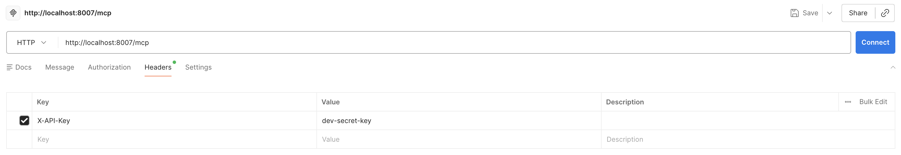
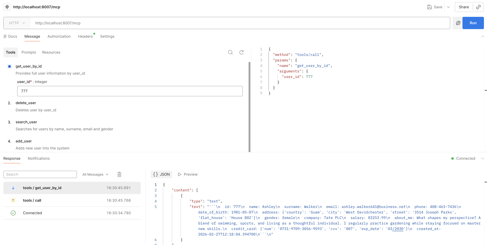
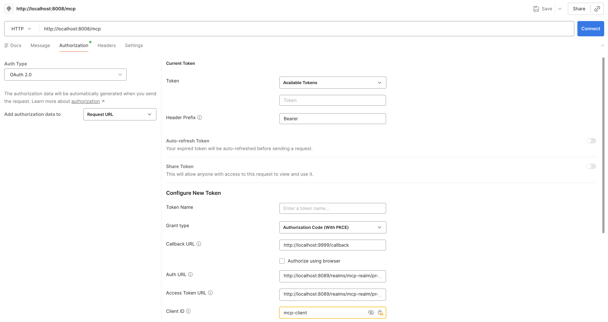
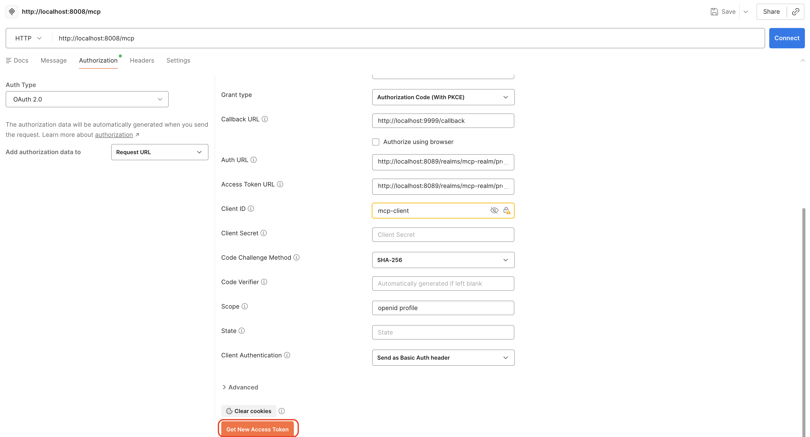
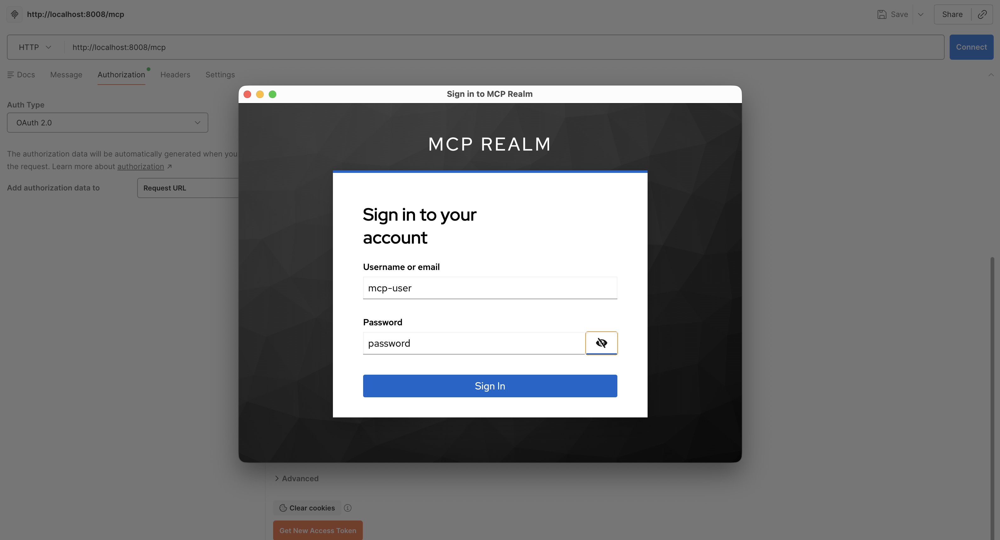
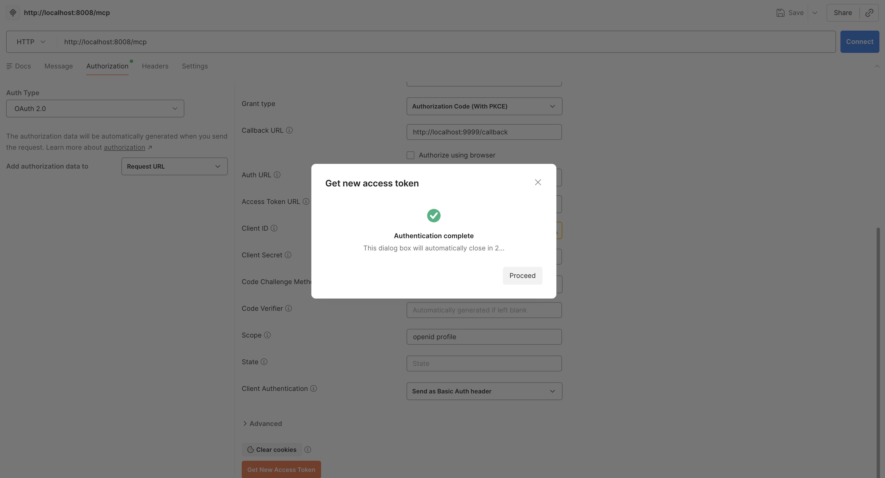
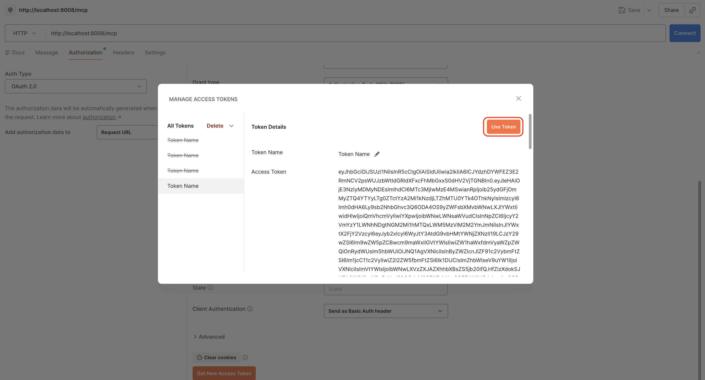
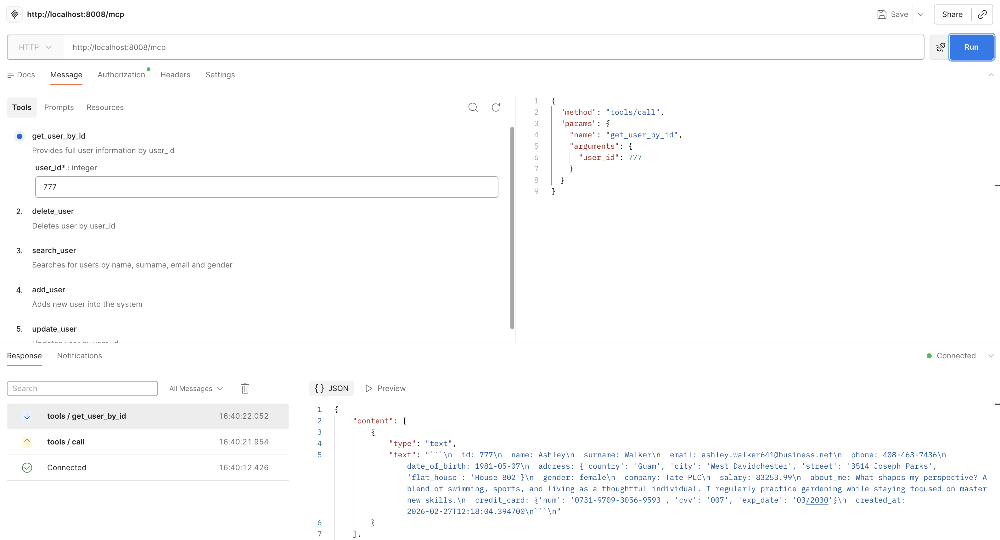

# MCP Auth

Java implementation for securing the Users Management MCP Server with two authentication strategies: **API Key** and
**OAuth 2.0 + PKCE via Keycloak**.

## Learning Goals

By exploring and working with this project, you will learn:

- Why authentication matters for MCP servers exposed over HTTP
- How to protect an MCP server with a simple API Key filter using Spring Security
- How to integrate OAuth 2.0 Authorization Code + PKCE flow with Keycloak
- How to validate JWT tokens (signature, issuer, expiry, roles) on the server side with Spring Security
- How to build an MCP client that transparently handles token refresh

### If the task in the main branch is hard for you, switch to the `main-detailed` branch

---

## Infrastructure Setup

### 1. Stop previous User Service (if running)

If you have the User Service container running from a previous task, **stop it first** to avoid port conflicts:

```bash
docker compose down
```

### 2. Start services

From the `tasks/src/t11/mcp/auth/` directory:

```bash
docker compose up
```

This starts:

- **User Service** — `http://localhost:8041` — the same REST users backend from previous tasks
- **Keycloak** — `http://localhost:8089` — Authorization Server

---

# Tasks

## Part 1 — API Key Authentication

A simple, stateless auth mechanism: the client sends a secret key in the `X-API-Key` header on every request. The server
validates it in a Spring Security filter before the request reaches the MCP logic.

### 1. Implement API Key security filter

Open [mcp/server/auth/ApiKey.java](mcp/server/auth/ApiKey.java) and implement all **TODO**.

The `SecurityFilterChain` bean should:

- Disable CSRF and configure stateless session management
- Register a custom `ApiKeyFilter` before `UsernamePasswordAuthenticationFilter`
- Require authentication for all requests; permit `ASYNC` dispatcher type (needed for SSE transport)

The inner `ApiKeyFilter` should:

- Read the `X-API-Key` header from the incoming request
- Return `401 Unauthorized` JSON if the key is missing or wrong
- Set a `UsernamePasswordAuthenticationToken` in the `SecurityContextHolder` if the key is valid

Valid key: `dev-secret-key`

### 2. Run the API Key MCP Server

Open [mcp/server/ApiKeyServerApp.java](mcp/server/ApiKeyServerApp.java) and run `main()`.

The server listens on **`http://localhost:8007/mcp`**.

### 3. (Optional) Test in Postman

<details>
<summary><b>Testing with Postman</b></summary>

Send a `POST` to `http://localhost:8007/mcp` with:

**With valid key — should succeed:**

```
X-API-Key: dev-secret-key
```

**Without key / wrong key — should return 401:**

```
X-API-Key: wrong-key
```

or omit the header entirely.




</details>

### 4. Implement API Key MCP Client and run the Agent

1. Open [agent/clients/ApiKeyMcpClient.java](agent/clients/ApiKeyMcpClient.java) and implement all **TODO**.

   Override `requestCustomizer()` to return a `Consumer<HttpRequest.Builder>` that attaches the `X-API-Key` header to
   every HTTP request sent to the MCP server.

   > **Hint:** See [agent/clients/BaseMcpClient.java](agent/clients/BaseMcpClient.java) to understand how
   > `requestCustomizer()` is wired into the transport.

2. Open [agent/App.java](agent/App.java) and make sure `ApiKeyMcpClient` is the active client:
   ```java
   BaseMcpClient mcpClient = new ApiKeyMcpClient("http://localhost:8007/mcp", MCP_API_KEY);
   ```

3. Run `App.java` and verify the agent works correctly.

---

## Part 2 — OAuth 2.0 + PKCE via Keycloak

A proper authorization flow: the user authenticates in a browser, Keycloak issues a signed JWT, and the MCP server
validates the token cryptographically on every request — no shared secrets needed.

---

## Keycloak

[Keycloak](https://www.keycloak.org/) is an open-source Identity and Access Management solution. It handles user
authentication, issues JWT tokens, and manages roles/permissions — so your services don't need to implement any of that
themselves.

In this task Keycloak acts as the **Authorization Server** in the OAuth 2.0 flow: it authenticates the user via a
browser login page and issues a signed JWT access token that the MCP server then validates on every request.

### Admin Console

|              |                       |
|--------------|-----------------------|
| **URL**      | http://localhost:8089 |
| **Username** | `admin`               |
| **Password** | `admin`               |

### Realm Configuration

The realm is pre-configured via [keycloak/mcp-realm-config.json](keycloak/mcp-realm-config.json). On first startup
Keycloak imports it automatically.

It defines:

| Setting     | Value                                                         |
|-------------|---------------------------------------------------------------|
| Realm name  | `mcp-realm`                                                   |
| Client ID   | `mcp-client`                                                  |
| Client type | Public (PKCE, no client secret)                               |
| Token TTL   | **60 seconds** ⚠️ (intentionally short to test token refresh) |

### Keycloak Endpoints

| Endpoint                   | URL                                                                     |
|----------------------------|-------------------------------------------------------------------------|
| Well-known / OpenID config | http://localhost:8089/realms/mcp-realm/.well-known/openid-configuration |
| JWKS (public keys)         | http://localhost:8089/realms/mcp-realm/protocol/openid-connect/certs    |
| Token                      | http://localhost:8089/realms/mcp-realm/protocol/openid-connect/token    |
| Authorize                  | http://localhost:8089/realms/mcp-realm/protocol/openid-connect/auth     |

### Pre-configured Users

| Username         | Password   | Role               | MCP Access        |
|------------------|------------|--------------------|-------------------|
| `mcp-user`       | `password` | `mcp-tools-access` | ✅ Allowed         |
| `no-access-user` | `password` | *(none)*           | ❌ Forbidden (403) |

### OAuth 2.0 + PKCE Request Flow

For a visual explanation of every step in the authorization flow (browser redirect → code exchange → JWT validation),
open:

👉 [oauth_request_flow.html](oauth_request_flow.html)

### 1. Implement JWT security filter chain

Open [mcp/server/auth/OAuth.java](mcp/server/auth/OAuth.java) and implement all **TODO**.

The `SecurityFilterChain` bean should:

- Build a `NimbusJwtDecoder` from the Keycloak JWKS URI with issuer validation (JWKS is fetched lazily — no Keycloak
  needed at startup)
- Enable `oauth2ResourceServer` JWT support with the custom decoder
- Register a `RoleCheckFilter` after `BearerTokenAuthenticationFilter`
- Require authentication for all requests; permit `ASYNC` dispatcher type (needed for SSE transport)

The inner `RoleCheckFilter` should:

- Extract `realm_access.roles` from the validated `JwtAuthenticationToken`
- Return `403 Forbidden` JSON if the required role (`mcp-tools-access`) is missing
- Pass through if the role is present

### 2. Run the OAuth MCP Server

Open [mcp/server/OAuthServerApp.java](mcp/server/OAuthServerApp.java) and run `main()`.

The server listens on **`http://localhost:8008/mcp`**.

### 3. (Optional) Test it in Postman

<details>
<summary><b>Testing with Postman</b></summary>

| Parameter                 | Value                                                                |  
|---------------------------|----------------------------------------------------------------------|
| URL                       | http://localhost:8008/mcp                                            | 
| Authorization > Auth Type | OAuth 2.0                                                            |
| Grant type                | PKCE                                                                 |
| Callback URL              | http://localhost:9999/callback                                       |
| Auth URL                  | http://localhost:8089/realms/mcp-realm/protocol/openid-connect/auth  |
| Access Token URL          | http://localhost:8089/realms/mcp-realm/protocol/openid-connect/token |
| Client ID                 | mcp-client                                                           |
| Code Challenge Method     | SHA-256                                                              |
| Scope                     | openid profile                                                       |








</details>

### 4. Implement OAuth MCP Client

Open [agent/clients/OAuthMcpClient.java](agent/clients/OAuthMcpClient.java) and implement all **TODO**.

The client should:

- Override `beforeConnect()` to run the PKCE browser flow (opens Keycloak login once)
- Override `requestCustomizer()` to return a `Consumer<HttpRequest.Builder>` that attaches
  `Authorization: Bearer <token>` to every request
- Override `callTool()` to check token expiry **before** each call and transparently refresh + reconnect

> **Why proactive refresh?**
> If the token expires mid-stream, the `HttpClientStreamableHttpTransport` connection breaks at the async transport
> layer — making after-the-fact recovery impossible. Checking expiry before each call avoids this entirely.

### 5. Run the Agent with OAuth

Open [agent/App.java](agent/App.java), switch to `OAuthMcpClient`:

```java
BaseMcpClient mcpClient = new OAuthMcpClient("http://localhost:8008/mcp");
```

Run `App.java`. A browser window will open for Keycloak login.

**Test with both users:**

- Login as `mcp-user` / `password` → agent works normally ✅
- Login as `no-access-user` / `password` → server returns `403 Forbidden` ❌

Since the token TTL is **60 seconds**, wait a bit between queries to observe the automatic token refresh in action.

<details>
<summary><b>Testing in Terminal</b></summary>


</details>
