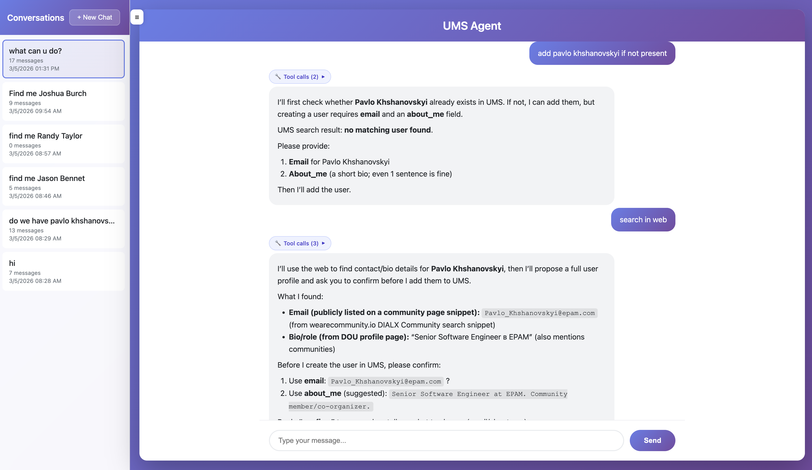
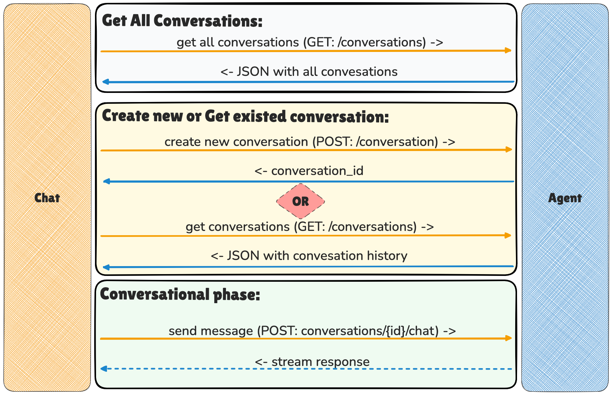
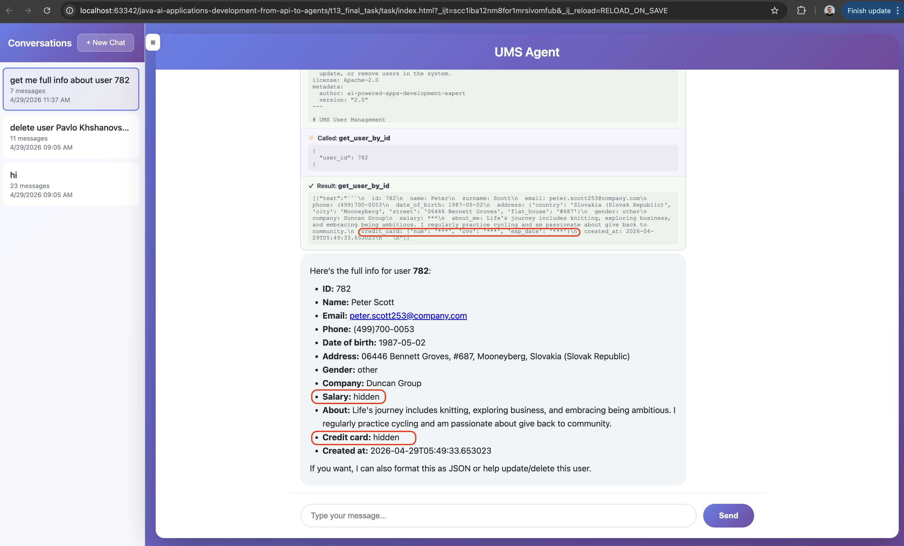

# Final Task: Users Management Agent

In this task, you will build a **production-ready Agent** with the Tool Use pattern connected to several MCP servers,
equipped with skills and Users PII protection (guardrail).
The agent supports both streaming and non-streaming responses, stores all conversations in Redis, and serves a
browser-based chat UI.

---

## Branches Structure

- `main` - tasks with descriptions
- `main-detailed` - tasks with super detailed descriptions

🚨 **This task doesn't have `completed` branch** 🚨

---

### UI


### Application architecture


---

## Tasks

### 1. Implement the UMS User Management Skill

Open [task/_skills/ums-user-management/SKILL.md](task/_skills/ums-user-management/SKILL.md) and implement all `TODO` items.

The skill instructs the agent on how to manage users via the UMS and DuckDuckGo MCP servers, including CRUD workflows,
search, and web enrichment.

---

### 2. Implement `McpTool`

Open [task/agent/tools/McpTool.java](task/agent/tools/McpTool.java) and implement all `TODO` items.

---

### 3. Implement `ReadSkillTool`

Open [task/agent/tools/ReadSkillTool.java](task/agent/tools/ReadSkillTool.java) and implement all `TODO` items.

A local `BaseTool` that reads skill files from the `_skills/` directory by relative path.
The agent calls it to load `SKILL.md` instructions before acting on a request.

---

### 4. Implement `UmsAgent`

Open [task/agent/UmsAgent.java](task/agent/UmsAgent.java) and implement all `TODO` items.

Wraps the OpenAI HTTP client and drives the **Tool Use** loop:
- `response()` — non-streaming completion with recursive tool calling
- `streamResponse()` — streaming completion that writes SSE chunks to the response `OutputStream`, handles tool call
  deltas, notifies the frontend about each tool call and result, then recursively streams the next response

---

### 5. Implement `ConversationManager`

Open [task/agent/ConversationManager.java](task/agent/ConversationManager.java) and implement all `TODO` items.

Manages the full conversation lifecycle backed by **Redis**:
- `createConversation()` / `listConversations()` / `getConversation()` / `deleteConversation()`
- `chat()` — loads history from Redis, injects the system prompt on the first turn, delegates to
  `UmsAgent.response()`, then persists the updated message list
- `streamChat()` — same as `chat()` but delegates to `UmsAgent.streamResponse()` and first writes a
  `conversation_id` SSE event to the output stream

---

### 6. Implement `App`

Open [task/agent/App.java](task/agent/App.java) and implement all `TODO` items.

Spring Boot application that:
1. Reads Redis host/port from env vars and starts the server on port `8011`
2. Loads skills from `_skills/` and builds the system prompt
3. Connects `HttpMcpClient` to the UMS MCP server and registers its tools
4. Connects `StdioMcpClient` to the DuckDuckGo MCP server and registers its tools
5. Registers `McpTool` for `HttpMcpClient` and `StdioMcpClient`
6. Registers `ReadSkillTool`
7. Creates `UmsAgent`, connects to Redis, creates `ConversationManager`

---

### 7. Implement `AgentController`

Open [task/agent/AgentController.java](task/agent/AgentController.java) and implement all `TODO` items.

Spring REST controller that exposes the agent API:
- `POST /conversations` — create conversation
- `GET /conversations` — list conversations
- `GET /conversations/{id}` — get conversation (404 if not found)
- `DELETE /conversations/{id}` — delete conversation (404 if not found)
- `POST /conversations/{id}/chat` — chat: if `stream=true` set SSE headers and delegate to
  `streamChat()`; otherwise return JSON; return 404 if the conversation does not exist

---

### 8. Implement `index.html`

Open [task/index.html](task/index.html) and implement all `TODO` items. It will be our UI interface to work with UMS Agent.

#### Conversation request flow


---

### 9. Run Infrastructure and Start the Application

1. Run [docker-compose.yml](docker-compose.yml) with UMS Service, UMS MCP Server, Redis, and Redis Insight.
2. Run `App.java` (Spring Boot). The server starts on `http://localhost:8011`.
3. Test your agent using the sample requests below.

---

### Sample Requests

```
Find all users with the surname "Smith"
```

```
Add Elon Musk as a new user
```

```
Update the email for user with ID 42
```

```
Delete user with ID 777 — make sure to confirm first
```

```
Search the web for the latest news about OpenAI and summarize it
```

---

### 10. Implement `Guardrail` (Additional Task)

**Since the agent works with PII, it must prevent credit card and salary data from leaking back to the UI.**

Open [task/agent/Guardrail.java](task/agent/Guardrail.java) and implement `Guardrail`.

The guardrail uses Java regex patterns to redact tool results before they are added to the conversation history:
- Detects **credit card numbers** (`num`, `cvv`, `exp_date` fields from UMS) in JSON, Python-dict, and standalone formats
- Detects **salary values** in YAML-like, JSON, and Python-dict formats

`UmsAgent` applies it after every tool result to prevent PII from being sent to the model or stored in conversations.



---

## Redis Insight

- Connect to Redis Insight at `http://localhost:6380`
- Add a database with URL `redis-ums:6379` to browse conversation data

---

**Congratulations! You've built an agent backed by multiple MCP servers, Redis persistence, a browser UI, and PII guardrails.**
