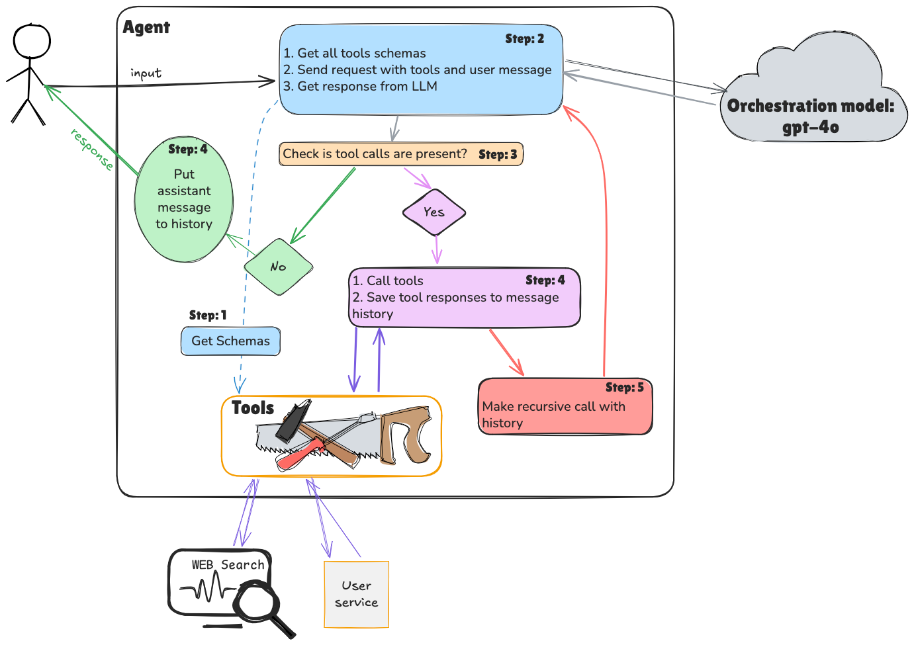

# AI Simple Agent Task

Java implementation for building AI-powered chat applications using the OpenAI and Anthropic API with advanced tool
integration.

## App Architecture



---

## Task

Implement a simple Agent from scratch that works with a User Service. You will practice defining custom tools and
driving the agentic loop via the OpenAI and Anthropic APIs.

### If the task in the main branch is hard for you, switch to the `main-detailed` branch

---

### 0. Run [docker-compose.yml](docker-compose.yml) with User Service (can be ignored if it still running from t6_grounding)

The mock user service runs on `localhost:8041` and provides several REST endpoints:

- `GET /v1/users` — list all users
- `GET /v1/users/{id}` — get a specific user
- `GET /v1/users/search` — search users by fields
- `POST /v1/users` — create a user
- `PUT /v1/users/{id}` — update a user
- `DELETE /v1/users/{id}` — delete a user
- `GET /health` — service health check
- Swagger UI 👉 http://localhost:8041/docs
- Use [mock-user-service.postman_collection.json](mock-user-service.postman_collection.json) in Postman to play with API

---

### 1. Implement the tools — [task/tools/](task/tools/)

Each tool extends `BaseTool` ([task/tools/BaseTool.java](task/tools/BaseTool.java)) and must implement three methods (
`getName()`, `getDescription()`, `getInputSchema()`) and one method (`execute()`). The `getInputSchema()` returns a JSON
Schema string and is shared by both the OpenAI and Anthropic schema builders already provided in `BaseTool`.

Start with the User Service tools in [task/tools/users/](task/tools/users/). Each one wraps a single User Service
endpoint:

- **[GetUserByIdTool.java](task/tools/users/GetUserByIdTool.java)** — fetch a user by numeric ID
- **[SearchUsersTool.java](task/tools/users/SearchUsersTool.java)** — search users by name / surname / email / gender
- **[CreateUserTool.java](task/tools/users/CreateUserTool.java)** — create a new user record
- **[UpdateUserTool.java](task/tools/users/UpdateUserTool.java)** — update an existing user record
- **[DeleteUserTool.java](task/tools/users/DeleteUserTool.java)** — delete a user by ID

Then implement the web search tool in **[task/tools/WebSearchTool.java](task/tools/WebSearchTool.java)** — it calls the
OpenAI Responses API (`gpt-5.2` with `tools: [{"type": "web_search"}]`) and extracts the result from the `output_text`
block in the response.

### 2. Implement `BaseAgent` — [task/agents/BaseAgent.java](task/agents/BaseAgent.java)

### 3. Implement the OpenAI agent — [task/agents/OpenAIBasedAgent.java](task/agents/OpenAIBasedAgent.java)

See the **OpenAI API Reference** section at the bottom for the exact request/response shapes.

### 4. Write the system prompt — [task/Prompts.java](task/Prompts.java)

### 5. Wire everything up — [task/App.java](task/App.java)

Implement `main()`:

- Create `UserServiceClient` and all tools
- Create `OpenAIBasedAgent` with `SYSTEM_PROMPT`
- Create `Conversation` and run the input loop: read user input, add it to the conversation, call `agent.getResponse`,
  add the reply and print it

Try the following sample inputs:

- `Add Andrej Karpathy as a new user`
- `Find all female users`
- `Delete user with id 3`

### 6. Implement the Anthropic agent — [task/agents/AnthropicBasedAgent.java](task/agents/AnthropicBasedAgent.java)

Extend `BaseAgent` for the **Anthropic Messages API**. Implement five methods:

Key differences from OpenAI summarised:

|               | OpenAI                                   | Anthropic                                             |
|---------------|------------------------------------------|-------------------------------------------------------|
| Auth header   | `Authorization: Bearer ...`              | `x-api-key: ...` + `anthropic-version`                |
| System prompt | message with `role: system`              | top-level `system` field                              |
| Tool schema   | `getOpenAiSchema()` (`parameters`)       | `getAnthropicSchema()` (`input_schema`)               |
| Stop signal   | `finish_reason: "tool_calls"`            | `stop_reason: "tool_use"`                             |
| Tool input    | JSON string → `objectMapper.readValue()` | `Map<String, Object>` directly (`block.get("input")`) |
| Tool results  | separate `tool` messages                 | grouped into one `user` message                       |

Switch `App.java` to `AnthropicBasedAgent` and run the same queries.

See the **Anthropic API Reference** section below for the exact request/response shapes.

---

## OpenAI Chat Completions API Reference

📖 Full docs: https://developers.openai.com/api/reference/resources/chat/subresources/completions/methods/create
🔧 Tool calling guide: https://developers.openai.com/api/docs/guides/function-calling

### Request Format

```json
{
  "model": "gpt-5.2",
  "system": "You are a helpful assistant.",
  "messages": [
    {
      "role": "system",
      "content": "You are a helpful assistant."
    },
    {
      "role": "user",
      "content": "Who is Andrej Karpathy?"
    }
  ],
  "tools": [
    {
      "type": "function",
      "function": {
        "name": "web_search_tool",
        "description": "Tool for WEB searching.",
        "parameters": {
          "type": "object",
          "properties": {
            "request": {
              "type": "string",
              "description": "The search query or question to search for on the web"
            }
          },
          "required": [
            "request"
          ]
        }
      }
    },
    {
      "type": "function",
      "function": {
        "name": "get_user_by_id",
        "description": "Provides full user information",
        "parameters": {
          "type": "object",
          "properties": {
            "id": {
              "type": "number",
              "description": "User ID"
            }
          },
          "required": [
            "id"
          ]
        }
      }
    },
    ...
  ]
}
```

### Response — with tool calls

```json
{
  "choices": [
    {
      "message": {
        "role": "assistant",
        "content": "",
        "tool_calls": [
          {
            "id": "call_6JriK7u5DL2heJ1lkw08WUFd",
            "function": {
              "arguments": "{\"request\":\"Andrej Karpathy profile\"}",
              "name": "web_search_tool"
            },
            "type": "function"
          }
        ]
      },
      "finish_reason": "tool_calls"
    }
  ]
}
```

### Tool result message (added to the conversation before the next call)

```json
{
  "role": "tool",
  "tool_call_id": "call_6JriK7u5DL2heJ1lkw08WUFd",
  "name": "web_search_tool",
  "content": "Andrej Karpathy is a Slovak-Canadian computer scientist..."
}
```

### Response — final answer

```json
{
  "choices": [
    {
      "message": {
        "role": "assistant",
        "content": "Andrej Karpathy is..."
      },
      "finish_reason": "stop"
    }
  ]
}
```

---

## Anthropic Messages API Reference

📖 Full docs: https://platform.claude.com/docs/en/api/messages/create
🔧 Tool calling guide: https://platform.claude.com/docs/en/agents-and-tools/tool-use/overview

### Request Format

```json
{
  "model": "claude-sonnet-4-5",
  "max_tokens": 8096,
  "system": "You are a helpful assistant.",
  "messages": [
    {
      "role": "user",
      "content": "Who is Andrej Karpathy?"
    }
  ],
  "tools": [
    {
      "name": "web_search_tool",
      "description": "Tool for WEB searching.",
      "input_schema": {
        "type": "object",
        "properties": {
          "request": {
            "type": "string",
            "description": "The search query or question to search for on the web"
          }
        },
        "required": [
          "request"
        ]
      }
    },
    {
      "name": "get_user_by_id",
      "description": "Provides full user information",
      "input_schema": {
        "type": "object",
        "properties": {
          "id": {
            "type": "number",
            "description": "User ID"
          }
        },
        "required": [
          "id"
        ]
      }
    },
    ...
  ]
}
```

### Response — with tool calls

```json
{
  "role": "assistant",
  "content": [
    {
      "type": "text",
      "text": "I'll search for information about Andrej Karpathy."
    },
    {
      "type": "tool_use",
      "id": "toolu_01A09q90qw90lq917835lq9",
      "name": "web_search_tool",
      "input": {
        "request": "Andrej Karpathy profile"
      }
    }
  ],
  "stop_reason": "tool_use"
}
```

### Sending the assistant turn + tool results back (one user message per round)

```json
{
  "role": "assistant",
  "content": [
    {
      "type": "text",
      "text": "I'll search for information about Andrej Karpathy."
    },
    {
      "type": "tool_use",
      "id": "toolu_01A09q90qw90lq917835lq9",
      "name": "web_search_tool",
      "input": {
        "request": "Andrej Karpathy profile"
      }
    }
  ]
},
{
"role": "user",
"content": [
{
"type": "tool_result",
"tool_use_id": "toolu_01A09q90qw90lq917835lq9",
"content": "Andrej Karpathy is a Slovak-Canadian computer scientist..."
}
]
}
```

### Response — final answer

```json
{
  "role": "assistant",
  "content": [
    {
      "type": "text",
      "text": "Andrej Karpathy is..."
    }
  ],
  "stop_reason": "end_turn"
}
```
