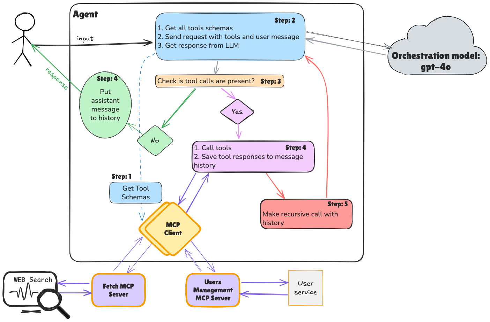

# MCP Fundamentals (Server & Client)

Java implementation for building Users Management Agent with MCP tools and MCP server

## Learning Goals

By exploring and working with this project, you will learn:

- How to configure simple MCP server
- How to configure client and connect to MCP server
- How to create simple Agent with tools from MCP server
- Key features of MCP

### If the task in the main branch is hard for you, switch to the `main-detailed` branch



---

# Tasks:

## HTTP

You need to implement the Users Management Agent, that will be able to perform CRUD operations within User Management
Service.

### 1. Create and run HTTP MCP server:

1. Run User Service [root docker-compose](docker-compose.yml) (Optional step in case if you have it from previous tasks)
2. Open [UmsMcpServer.java](mcp/server/UmsMcpServer.java) and implement all ***TODO***
3. Open [HttpServerApp.java](mcp/server/HttpServerApp.java) and **Run** it

<details> 
<summary><b>OPTIONAL: Work with HTTP MCP server in Postman</b></summary>


</details>

### 2. Create and run Agent:

1. Open [BaseClient.java](agent/mcp/client/BaseClient.java) and implement all ***TODO***
2. Open [HttpClient.java](agent/mcp/client/HttpClient.java) and implement all ***TODO***
3. Open [Agent.java](agent/Agent.java) and implement all ***TODO***
4. Open [Prompts.java](agent/Prompts.java) and write System prompt
5. Open [App.java](agent/App.java) and implement all ***TODO***
6. Run application [App.java](agent/App.java) and test that it is connecting to MCP Server and works properly
7. Try with `fetch MCP` `https://remote.mcpservers.org/fetch/mcp` instead of http://localhost:8005/mcp

### OPTIONAL: Support both (users-management and fetch) MCP servers:

1. Remember that we have 1-to-1 connection between MCP client and MCP server!
2. You need to think of the way how to change current flow to support tools from different MCP servers and implement it
3. In the end you should have the Agent that is able to fetch the info from the WEB about some people and save it to
   Users Service
4. Hint: the problem place is [Agent.java](agent/Agent.java)

---

## STDIO

### 1. Create and run Agent with STDIO MCP Client:

1. Open [StdioClient.java](agent/mcp/client/StdioClient.java) and implement all ***TODO***
2. Open [App.java](agent/App.java) and instead of `HttpClient` use:
    ```java
    String javaClasspath = System.getProperty("java.class.path");
    try (BaseClient mcpClient = new StdioClient(
            null,
            "java",
            List.of("-cp", javaClasspath, "t9.mcp.fundamentals.mcp.server.StdioServerApp"),
            null
    )) {
        runAgent(mcpClient);
    }
    ```
3. Run application [App.java](agent/App.java) and test that it is connecting to STDIO MCP Server and works properly

<details> 
<summary><b>Connecting Your STDIO MCP Server to Claude Desktop</b></summary>

This uses your compiled `StdioServerApp` Java class — simplest and most reliable for local development.

### Step 1: Find Claude Desktop config file

| OS          | Path                                                              |
|-------------|-------------------------------------------------------------------|
| **macOS**   | `~/Library/Application Support/Claude/claude_desktop_config.json` |
| **Windows** | `%APPDATA%\Claude\claude_desktop_config.json`                     |

### Step 2: Find your tool paths

Claude Desktop runs with a **restricted `PATH`** (`/usr/bin:/bin:/usr/sbin:/sbin`) — it cannot see Homebrew, SDKMAN, or any tool installed by your shell profile. You must use absolute paths in the config.

Run these in your terminal to find the correct paths:

```bash
which mvn   # → e.g. /opt/homebrew/bin/mvn  (needed for Option A)
which java  # → e.g. /usr/bin/java           (needed for Option B)
```

On macOS you can also use:

```bash
/usr/libexec/java_home   # prints the active JDK home, java binary is at <output>/bin/java
```

### Step 3: Compile the project

```bash
cd {ABSOLUTE_PATH}/java-ai-applications-development-from-api-to-agents
mvn compile
```

### Step 4: Edit the config

Open the file (create it if it doesn't exist) and add your server.

**Run via Maven exec:java:**

> **Java version pitfall:** Maven uses its own bundled JDK which may differ from your project's JDK.
> If your classes are compiled with Java 25 but Maven runs on Java 23, you get `UnsupportedClassVersionError`
> and Claude shows `-32000: Connection closed`. Fix: pass `JAVA_HOME` in the `env` block to force Maven
> to use the correct JDK. Run `/usr/libexec/java_home` to find your active JDK path.

```json
{
  "mcpServers": {
    "users-management": {
      "command": "{FULL_PATH_TO_MVN}",
      "env": {
        "JAVA_HOME": "{FULL_PATH_TO_JDK_HOME}"
      },
      "args": [
        "-q",
        "-f",
        "{ABSOLUTE_PATH}/java-ai-applications-development-from-api-to-agents/pom.xml",
        "exec:java",
        "-Dexec.mainClass=t9.mcp.fundamentals.mcp.server.StdioServerApp"
      ]
    }
  }
}
```

---

**Important notes:**

- Replace `{ABSOLUTE_PATH}` with the absolute path to the project on your local machine
- Replace `{FULL_PATH_TO_MVN}` with the output of `which mvn`
- Option B: re-run the Step B-1 command after any `pom.xml` dependency change
- All server logging is suppressed (`logging.level.root=OFF`) — stdout belongs to the protocol

<details> 
<summary><b>Sample config on Mac (Option A):</b></summary>

```json
{
  "mcpServers": {
    "users-management": {
      "command": "/opt/homebrew/bin/mvn",
      "env": {
        "JAVA_HOME": "/Users/pavlokhshanovskyi/Library/Java/JavaVirtualMachines/loom-ea-25-loom+1-11/Contents/Home"
      },
      "args": [
        "-q",
        "-f",
        "/Users/pavlokhshanovskyi/Downloads/dialx/courses/java-ai-applications-development-from-api-to-agents/pom.xml",
        "exec:java",
        "-Dexec.mainClass=t9.mcp.fundamentals.mcp.server.StdioServerApp"
      ]
    }
  }
}
```


</details>

### Step 5: Restart Claude Desktop

Fully quit and reopen Claude Desktop. While reopening, Claude may ask for access to the project. In the connectors
section you will be able to find users-management.

</details>

<details> 
<summary><b>Play in Postman with your STDIO MCP Server</b></summary>

Configuration is the same as you have for Claude 👆


</details>


### 2. Play with STDIO MCP Servers from Docker images:

1. Use such `mcpClient` in `App.java`:
    ```java
    try (BaseClient mcpClient = new StdioClient("mcp/duckduckgo:latest", null, null, null)) {
        runAgent(mcpClient);
    }
    ```
2. It is an MCP Server with WEB Search capabilities, [source code](https://github.com/khshanovskyi/duckduckgo-mcp-server)
3. Try to search `What is the weather in Kyiv now?`
